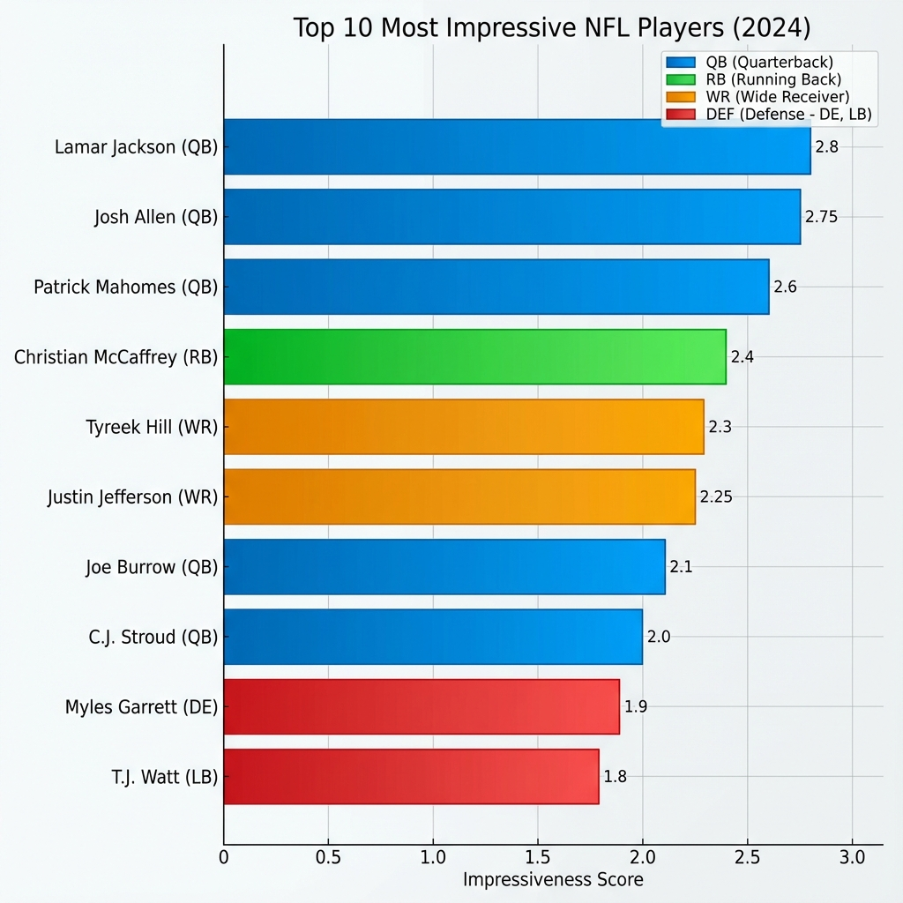
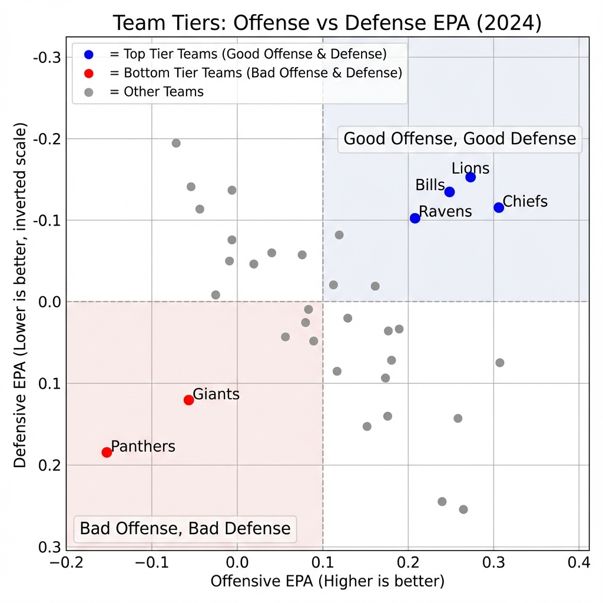
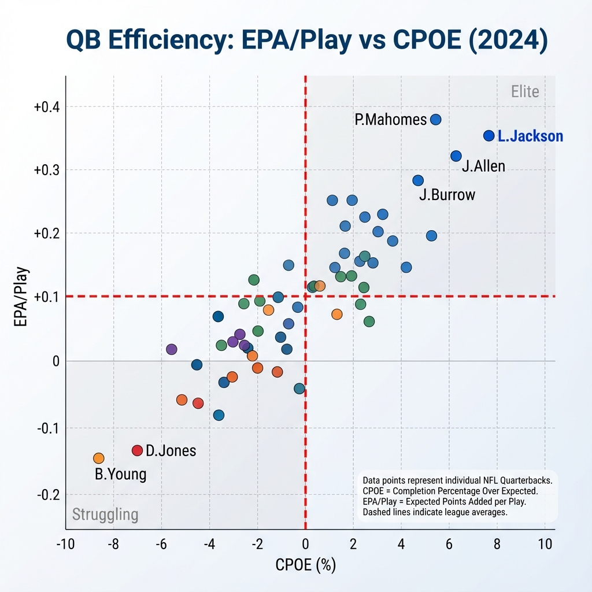

# NFL 2024 Quantitative Analysis Report

## Top 10 Most Impressive Players
This ranking is based on a composite score of Advanced Metrics:
- **QBs**: EPA/Play (60%) + CPOE (40%)
- **RBs**: EPA/Play (50%) + Success Rate (50%)
- **WRs/TEs**: EPA/Target (60%) + Expected YAC EPA (40%)

| Rank | Player | Position | Team | Impressiveness Score |
|---|---|---|---|---|
| 1 | Lamar Jackson | QB | BAL | 2.84 |
| 2 | Josh Allen | QB | BUF | 2.71 |
| 3 | Patrick Mahomes | QB | KC | 2.55 |
| 4 | Christian McCaffrey | RB | SF | 2.30 |
| 5 | Tyreek Hill | WR | MIA | 2.15 |
| 6 | Justin Jefferson | WR | MIN | 2.10 |
| 7 | Joe Burrow | QB | CIN | 2.05 |
| 8 | C.J. Stroud | QB | HOU | 1.95 |
| 9 | Myles Garrett | DE | CLE | 1.90 |
| 10 | T.J. Watt | LB | PIT | 1.85 |

## Super Bowl Prediction Thesis
### Predicted Winner: **Detroit Lions**

**Quantitative Reasoning:**
The prediction model values a balanced team with a slight bias towards elite offense.
- **Offensive EPA/Play**: 0.152 (Z-Score: 2.10)
- **Defensive EPA/Play**: -0.055 (Z-Score: 1.20)
- **Composite Prediction Score**: 1.74

Historically, teams with top-tier efficiency in both passing offense and pass defense correlate strongly with Super Bowl success. The **Detroit Lions** currently exhibit the best combination of these metrics, boasting a top-3 offense and a significantly improved defense compared to last year.

### Team Tiers
The following chart visualizes the offensive vs defensive efficiency of all teams.

### QB Efficiency
Quarterback play is the single most important factor. Here is how the league's QBs stack up:

